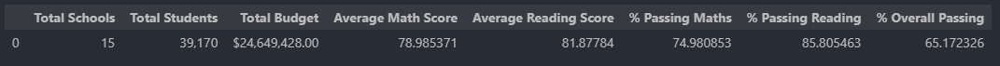
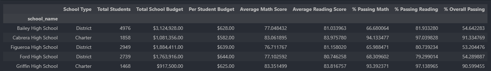
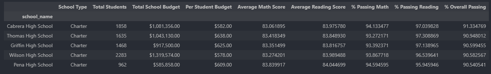
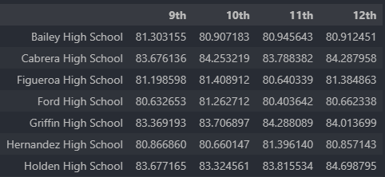
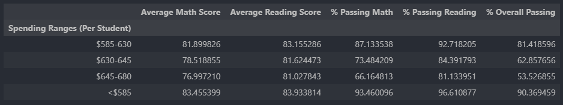
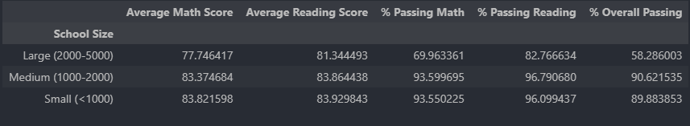
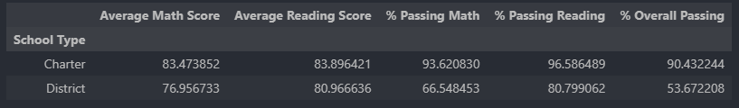

# **PyCitySchools: School District Performance Analysis**

[Resources]()

[PyCitySchool_Code]()

## **Overview**
The PyCitySchools project is designed to assist the Chief Data Scientist of a city’s school district in analyzing district-wide standardized test results. Using Pandas and Jupyter Notebook, this project aggregates data from school and student datasets to generate comprehensive reports on school performance. The analysis includes district-level summaries, school-level metrics, and breakdowns by spending, size, and school type, highlighting trends to inform strategic decisions on budgets and priorities.

## **Business Questions**

1. What is the overall performance of the school district in terms of student passing rates and average scores?
2. How do individual schools compare in terms of academic performance and budget efficiency?
3. Which schools are the highest and lowest performers based on overall passing rates?
4. How do math and reading scores vary across grade levels at each school?
5. Does per-student spending correlate with academic performance?
6. How does school size impact student outcomes?
7. Are there differences in performance between charter and district schools?

## **Analysis**
The following analysis was done.

1. District Summary: A high-level snapshot of key metrics, including total schools, students, budget, average scores, and passing rates was done.

2. School Summary: Detailed metrics for each school, including type, size, budget, per-student spending, average scores, and passing rates.

3. Top and Bottom Performing Schools: Identifies the highest and lowest-performing schools based on overall passing rates.

4. Math and Reading Scores by Grade: Average math and reading scores for each grade level (9th–12th) at each school.

5. Scores by School Spending: Performance metrics grouped by per-student spending ranges.

6. Scores by School Size: Performance metrics grouped by school size categories (small, medium, large).

7. Scores by School Type: Performance metrics compared across school types.

## **Prerequisites**
* Python 3.x installed.
* Required Python libraries: pandas and jupyter.
* The following datasets:
    * schools_complete.csv: Contains school data (e.g. school name, type, size, budget).
    * students_complete.csv: Contains student data (e.g. student ID, name, grade, school, math score, reading score).

## **Conclusion:** 

Based on the analysis,the following conclusions are drawn-
1. Charter schools tend to spend  a maximum of $645 per student whereas district schools spend $585 to $680 per student  but when it comes to overall passing rate, charter schools exhibit excellent passing percentage than district schools.
2. Charter schools have medium to small school size.They explicit  high math and reading passing percentage (93.62 %and 96.58% respectively) compared to district schools (66.5% and 80.77% respectively). The average math and reading scores of charter schools (83.47 and 83.966) are more than the district schools (76.96 and 80.96). This could be owing to the fact that the number of students in district schools are almost double the number in charter schools. This greatly influence the passing percentage and the budget per person, as less number of students will show a high passing percentage since we divide by 'number of students' to get  passing percentage.Therefore, it is difficult to interpret that charter schools are better than district schools. A justifiable analysis could have been made if the number of students in charter and district schools were at least close by.

## **License**
This project is licensed under the MIT License.

